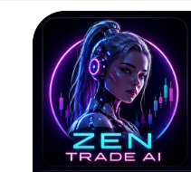
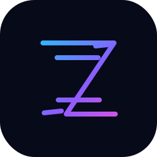
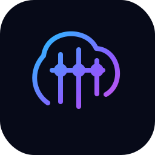
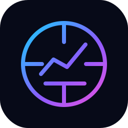
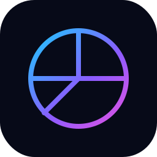
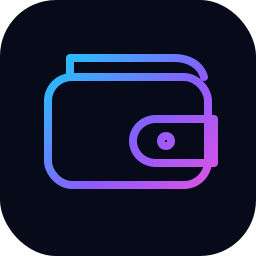

# ZenTrade_AI SVG-Uebersicht

Diese Seite dokumentiert die SVG-Grafiken in diesem Ordner und den zugehoerigen Varianten.

## Vorschau

  

  
  
  

  
  
  

  
  
  

## Hauptgrafiken in diesem Ordner

- `ai-analytics.svg`
- `ai-assistant.svg`
- `alerts.svg`
- `auto-trading.svg`
- `continuous-24-7.svg`
- `fast-execution.svg`
- `market-scan.svg`
- `performance.svg`
- `portfolio.svg`
- `risk-management.svg`
- `settings.svg`
- `sprite.svg`
- `trading-bot-loop.svg`
- `wallet.svg`
- `z-logo-favicon.svg`
- `zentrade-ai-brand-icon.svg`
- `zentrade_ai_icon_clean.svg`

## Varianten-Saetze

Unter `zentrade_ai_svg_transparent_set/` liegen mehrere Varianten derselben Motive:

- `source-original/`
- `svg-currentcolor/`
- `svg-dark/`
- `svg-light/`
- `svg-transparent/`

Typische Motive dort:

- `ai-analytics.svg`
- `ai-robot-woman.svg`
- `alerts.svg`
- `auto-trading.svg`
- `continuous-247.svg`
- `fast-execution.svg`
- `favicon-z.svg`
- `github-avatar.svg`
- `market-scan.svg`
- `portfolio.svg`
- `risk-management.svg`
- `settings.svg`
- `wallet.svg`
- `zentrade-ai-brand-icon.svg`

## Verwendung im Projekt

Diese Grafiken sind die aktuelle Hauptbasis fuer:

- Branding von ZenTrade_AI
- Favicons und Markenicons
- thematische UI- und Doku-Grafiken
- spaetere Web- oder Dashboard-Integrationen

## Verwandte Dateien

- `../README.md`
- `../../logo.svg`
- `../../zenbot_master.svg`
